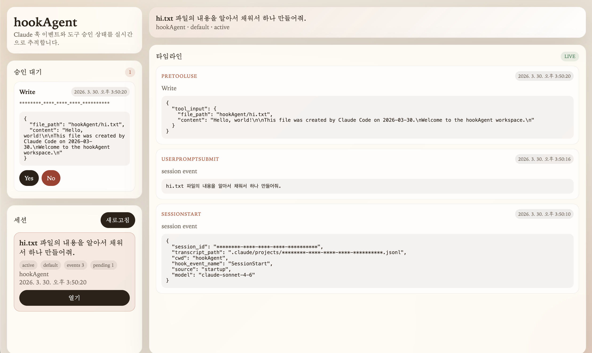

<div align="center">

# hookAgent



**HookAgent는 AI Agent의 사용자 입력, 추론, 도구 사용을 가로채고 감시하여 나쁜 행동을 탐지하고 제한합니다.**

</div>

- [미리보기 이미지 설명](./docs/img/Description.png)
- [사용자의 수락을 기다리는 에이전트](./docs/img/WatingUserAccept.png)
- [도구 사용을 거절했을때 에이전트](./docs/img/WhenDeny.png)

## 탐지 과정

1. 사용자 입력에 프롬프트 인젝션 내용이 없는가?
2. 사용자 입력에 따른 정당한 추론인가?
3. 정당한 추론에 따른 정당한 도구 사용인가?
4. 도구 사용 결과가 추론에 부합하는가?

## 사용 방법

```bash
python app.py --agent claude
```

gemini-cli는 먼저 로컬 extension으로 연결한 뒤 실행합니다.

```bash
gemini extensions link ./plugins/gemini-auditor
python app.py --agent gemini
```

Codex는 프로젝트 로컬 `.codex/` 설정으로 hooks를 활성화합니다.

```bash
python app.py --agent codex
```

## 크로스플랫폼 실행 메모

- 현재 코드는 Windows, macOS, Linux를 모두 대상으로 실행되도록 맞춰져 있습니다.
- `app.py`는 브라우저 열기를 Python 표준 `webbrowser`로 처리하고, 서버/훅 Python 프로세스는 UTF-8 환경으로 고정합니다.
- Claude 플러그인 경로와 Gemini extension 경로는 절대경로로 전달하므로, 실행 위치가 달라도 프로젝트 루트 기준으로 동작합니다.
- 에이전트 실행 파일 이름이 기본값과 다르면 환경변수로 덮어쓸 수 있습니다.

```bash
HOOK_AGENT_CLAUDE_BIN=claude python app.py --agent claude
HOOK_AGENT_GEMINI_BIN=gemini python app.py --agent gemini
HOOK_AGENT_CODEX_BIN=codex python app.py --agent codex
```

- 브라우저 자동 열기를 끄려면 아래 값을 사용합니다.

```bash
HOOK_AGENT_OPEN_BROWSER=0 python app.py --agent gemini
```

- Codex 훅은 현재 upstream Codex 제한 때문에 Windows에서는 동작하지 않습니다. Linux/macOS에서만 hook integration을 사용할 수 있습니다.

## 문서 목록

- [프로젝트 개요](docs/project-overview.md)
- [현재 구현](docs/current-implementation.md)
- [컨트롤 패널](docs/control-panel.md)
- [로드맵](docs/roadmap.md)
